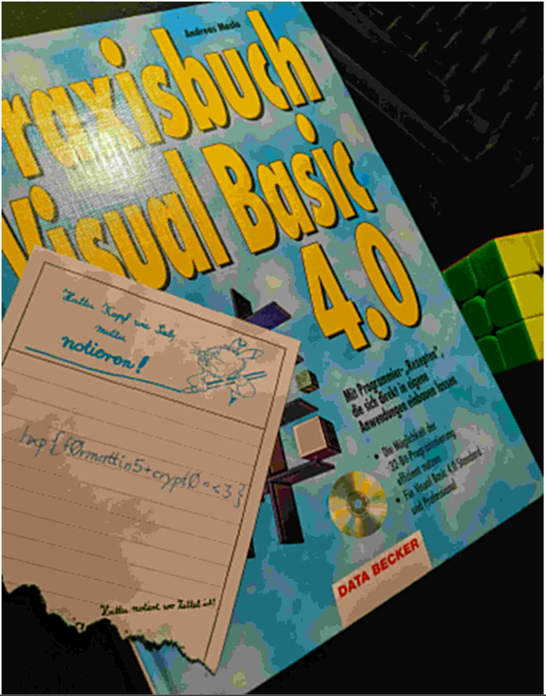

# caBalS puking (hxp CTF 2020)

Challenge description:

```
Hey, did you hear the good news? We were finally able to get ADB access to kirschju’s phone. All we could find on the file system were two Signal backup files, though. Nevertheless, with hxp’s ever-delayed challenge development process, there is hope that we might find a flag in the backup.

The first backup coincides closely with the registration time of the target Signal account, so we believe it represents the state of an empty account. The second backup file is a lot larger, for sure there’s some valuable piece of information in there.

We’re also attaching the Signal app retrieved from the phone for your reference, but it doesn’t seem to be modified compared to a vanilla app.
```

* Category: misc, crypto
* Points: 667 points (6 solves)
* Author: `kirschju`

Given files: `Signal.apk`, `signal-2021-11-29-22-02-26.backup`, `signal-2021-11-30-00-18-47.backup`

# Solution

We are given two backup files and the apk that created them.
I started by searching for tools that can parse and decrypt the backup files:

* https://github.com/bepaald/signalbackup-tools (cpp)
* https://github.com/SoftwareArtisan/signal-backup-exporter (python :))

Both seems to request 30 digits passphrase to decrypt the db.
The tools seems to read iv and salt from the backup header. I used `signalbackup-tools` on both files to check their properties:

```bash
$ ./signalbackup-tools signal-2021-11-29-22-02-26.backup 000000000000000000000000000000
signalbackup-tools (./signalbackup-tools) source version 20211109.080912 (OpenSSL)
IV: (hex:) 87 16 6a b8 af 3c 58 62 9f f5 c5 eb 5b 47 1e bc (size: 16)
SALT: (hex:) 0e 66 21 b2 8a 61 8a 65 28 93 e8 42 99 b8 fc 82 04 e8 0f 0a 3a 00 d6 12 c3 1a 8c b8 90 f9 f8 e9 (size: 32)
BACKUPKEY: (hex:) f3 1d 9f 1e c4 58 ac a7 d9 b2 66 00 2f d7 2f 27 fd ca 24 58 06 7e 6b 17 dd 5e f6 8e 47 e4 d6 62 (size: 32)
CIPHERKEY: (hex:) d1 45 0b aa 07 81 e9 84 1d e9 3d 28 81 c1 63 e5 41 e5 46 30 43 6c 58 5d 4b 6e 2f b1 7c c2 89 69 (size: 32)
MACKEY: (hex:) 24 aa d0 9b 42 68 28 bc cb a8 08 50 af 39 93 fc 36 3a a8 47 d4 96 e6 09 58 89 d6 82 d3 0d ed b0 (size: 32)
COUNTER: 2266393272
Reading backup file...
FRAME 0 (000.0%)... 
WARNING: Bad MAC in frame: theirMac: (hex:) ff ec 53 c8 58 a9 f6 64 1a 7a
                             ourMac: (hex:) a9 cc c3 db d7 28 f3 0a 18 5d 0d de 42 89 9a 45 27 a8 13 28 31 57 ca e2 e4 37 1e 88 74 cc 0b 59
...

$ ./signalbackup-tools signal-2021-11-30-00-18-47.backup 000000000000000000000000000000
signalbackup-tools (./signalbackup-tools) source version 20211109.080912 (OpenSSL)
IV: (hex:) 87 16 6a b8 af 3c 58 62 9f f5 c5 eb 5b 47 1e bc (size: 16)
SALT: (hex:) 0e 66 21 b2 8a 61 8a 65 28 93 e8 42 99 b8 fc 82 04 e8 0f 0a 3a 00 d6 12 c3 1a 8c b8 90 f9 f8 e9 (size: 32)
BACKUPKEY: (hex:) f3 1d 9f 1e c4 58 ac a7 d9 b2 66 00 2f d7 2f 27 fd ca 24 58 06 7e 6b 17 dd 5e f6 8e 47 e4 d6 62 (size: 32)
CIPHERKEY: (hex:) d1 45 0b aa 07 81 e9 84 1d e9 3d 28 81 c1 63 e5 41 e5 46 30 43 6c 58 5d 4b 6e 2f b1 7c c2 89 69 (size: 32)
MACKEY: (hex:) 24 aa d0 9b 42 68 28 bc cb a8 08 50 af 39 93 fc 36 3a a8 47 d4 96 e6 09 58 89 d6 82 d3 0d ed b0 (size: 32)
COUNTER: 2266393272
Reading backup file...
FRAME 0 (000.0%)... 
WARNING: Bad MAC in frame: theirMac: (hex:) ff ec 53 c8 58 a9 f6 64 1a 7a
                             ourMac: (hex:) a9 cc c3 db d7 28 f3 0a 18 5d 0d de 42 89 9a 45 27 a8 13 28 31 57 ca e2 e4 37 1e 88 74 cc 0b 59
...
```

The backup, cipher and mac keys are derived from the passphrase and the salt.

The data is splitted into separated frames.
The encryption seems to be some variation of AES CTR on each frame of the data.
Pseudo code:

```
IV = <16 bytes value>
for frame in data:
    IV[0:4] += 1
    IV_TMP = IV
    for block in frame:
        enc_block = xor(block, aes(IV_TMP))
        IV_TMP += 1
```

The counter (4 most significant bytes of the iv) is incremented between each frame,
And the whole iv is incremented between blocks.

As we've seen both of the backups shares the same iv and salt (and probably the same passphrase),
so by xoring each of their frames respectively we can get rid of the encrypted aes stream and have the xored plaintexts.
Also, If we will have the plaintext of one of them we can xor it with the encrypted data and retrieve the aes stream for each frame.

We know that one of the backups is for a new account! So we can create a fresh account and (hopefully) get similar backup.
I created a new account (using the provided apk) with the name `kirschju`, then created a backup for it.
And  saw it is nearly the same size of the empty backup provided:

```
3764359 my.backup
3764364 signal-2021-11-29-22-02-26.backup
4118872 signal-2021-11-30-00-18-47.backup
```

I modified the python tool `decrypt_frame` function to store each decrypted frame raw data.

```python
decrypted_frames = [] 				# ADDED
def decrypt_frame(bfile, ofile, length, with_iv=False):
    b_crypto.update_iv_from_counter()
    b_crypto.bump_counter()
    mac = b_crypto.get_mac()

    aes_cipher = b_crypto.aes_cipher
    enc_iv = b_crypto.iv
    if with_iv:
        mac.update(b_crypto.iv)

    def get_chunk():
        # Read as many 16 byte chunks as possible
        for i in range(int(length / 16)):
            yield bfile.read(16)
        # Read remainder
        yield bfile.read(length % 16)

    decrypted_frame = b''			# ADDED
    for enc_chunk in get_chunk():
        mac.update(enc_chunk)
        output = strxor.strxor(
            enc_chunk,
            aes_cipher.encrypt(enc_iv)[:len(enc_chunk)]
        )
        decrypted_frame += output	# ADDED
        ctr = int.from_bytes(enc_iv, byteorder='big') + 1
        enc_iv = int.to_bytes(ctr, length=16, byteorder='big')
        ofile.write(output)
    decrypted_frames.append(output)	# ADDED

    our_mac = mac.digest()
    our_mac = our_mac[:10]  # trim to 1st 10 bytes
    their_asset_mac = bfile.read(10)

    assert hmac.compare_digest(our_mac, their_asset_mac)
```

I decrypted the empty backup and stored the decrypted_frames list into a file.


I wanted to extract the encrypted frames from the encrypted backups.

Each frame begins with four bytes size, and the encrypted data afterwards.
After the frame data is decrypted it is parsed (using protobuf) to determine its kind, and if its an avatar/sticker/attachment its content are read from the backup as another frame. The problem is that, the size of the content are determined based on the decrypted "metadata" frame.

However, the frame size is usually less than 65536 bytes, so regular frames begins with \x00\x00.
That way we can extract frames that starts with \x00\x00, and when encountering avatar/sticker/attachment content we can guess its size by searching for the next frame.

```python
def get_frame(data: bytes):
    if data.startswith(b'\x00\x00'):
        size = int.from_bytes(data[:4], 'big') + 4
        return size, data[4:size]
    else:
        size = data.find(b'\x00\x00')
        # making sure its not a random \x00\x00
        while size + 4 + int.from_bytes(data[size:size+4], 'big') != data.find(b'\x00\x00', size+4):
            size = data.find(b'\x00\x00', size+4)
        return size, data[:size]

def extract_frames(backup_data: bytes):
    frames = []
    while backup_data:
        size, block = get_frame(backup_data)
        backup_data = backup_data[size:]
        frames.append(block)
    return frames[1:] # return frames (without the header)
        
```

I extracted both backups encrypted frames, and compared the empty backup frame sizes with the frames from my phone.
At the beginning the sizes seems identical but at some point it becomes totally different.
It looks like the frames are ordered differently in the two backups. so we can't xor the frames by order to get the aes stream for each frame.

Also, some data (for example the registered phone number) is different, so specific parts may differ between the empty backups (hopefully it won't matter :)).

I decided to iterate over all reasonable combinations (based on the frames sizes).

```python
from pathlib import Path

def xor(a, b):
    return bytes(aa ^ bb for aa, bb in zip(a, b))

# previously generated using signal-backup-exporter
my_backup_decrypted_frames = eval(Path('my_backup_frames').read_text())
empty_encrypted_frames = extract_frames(Path('signal-2021-11-29-22-02-26.backup').read_bytes())
full_encrypted_frames = extract_frames(Path('signal-2021-11-30-00-18-47.backup').read_bytes())

print(len(my_backup_decrypted_frames), 'frames in my empty backup!')
print(len(empty_encrypted_frames), 'frames in encrypted empty backup!')
print(len(full_encrypted_frames), 'frames in encrypted full backup!')

# remove unrecoverable frames from full backup
full_encrypted_frames = full_encrypted_frames[:len(empty_encrypted_frames)]

# generate possibles aes streams
aes_streams = {}
for i, enc_frame in enumerate(empty_encrypted_frames):
    aes_streams[i] = []
    for dec_frame in my_backup_decrypted_frames:
        if abs(len(enc_frame) - len(dec_frame)) < 20:
            aes_streams[i].append(xor(enc_frame, dec_frame))

# decrypt each frame with all the streams found for it
decrypted = b''
for i, enc_frame in enumerate(full_encrypted_frames):
    for aes_stream in aes_streams[i]:
        decrypted += xor(enc_frame, aes_stream)

Path('decrypted_chunks').write_bytes(decrypted)
print('Done!')
```

```bash
$ python3 decrypt_backup.py 
326 frames in my empty backup!
326 frames in encrypted empty backup!
356 frames in encrypted full backup!
Done!
```


Searching for the flag

```bash
$ strings decrypted_chunks | grep -i hxp -C 2
$ strings decrypted_chunks | grep -i flag -C 2
VINSERT INTO sms VALUES (?,?,?,?,?,?,?,?,?,?,?,?,?,?,?,?,?,?,?
?,?,?,?,?,?,?,?,?,?,?,?)
I can haz flag?
$dc9d94b0-6282-438>-aga9!4k9=7db8a942
VINSERT INTO sms VALUES (?,?,?,?,?,?,?,?,?,?,?,?,?,?,?,?,?,?,?
--
VINSERT INTO sms VALUES (?,?,?,?,?,?,?,?,?,?,?,?,?,?,?,?,?,?,?
?,?,?,?,?,?,?,?,?,?,?,?)
I can haz flag?
B=#i7NY
OXkK
--
...

```

The message "I can haz flag?" is inserted into the db.

Maybe the flag was sent in an attachment?

```bash
$ binwalk decrypted_chunks 

DECIMAL       HEXADECIMAL     DESCRIPTION
--------------------------------------------------------------------------------
201575        0x31367         JPEG image data, JFIF standard 1.01
298277        0x48D25         JPEG image data, JFIF standard 1.01
```

Extracting all files found `binwalk --dd=".*" decrypted_chunks`.
When trying to open both images I receive an error related to the jpeg markers (probably few bytes got broken in the stream).

But the files indeed look like a valid JPEGs, I tried to open them online...





Flag: `hxp{f0rmattin5+crypt0=<3}`